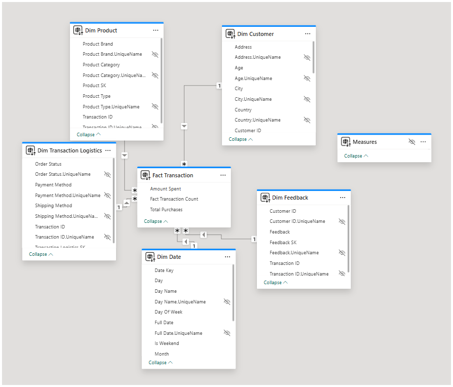
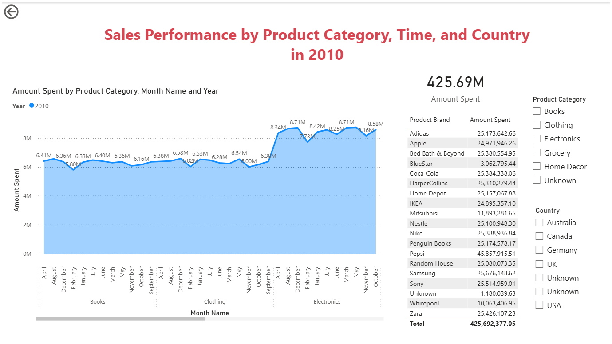
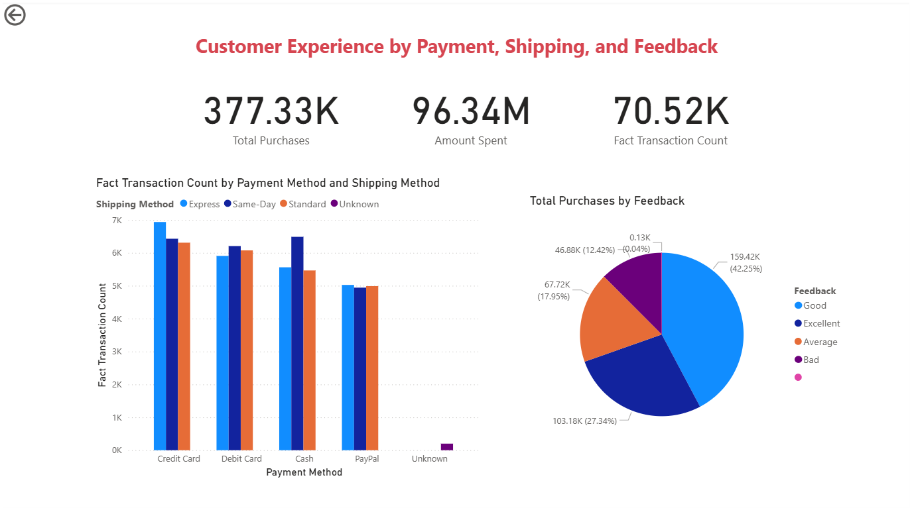

# 🛒 Retail Transactional Data Warehouse & BI Project

## 📊 Project Overview

This project encompasses the end-to-end development of a retail data warehouse and business intelligence solution. It involves:

* Designing a star schema data warehouse
* Implementing ETL processes using SQL Server Integration Services (SSIS)
* Developing an OLAP cube with SQL Server Analysis Services (SSAS)
* Creating interactive dashboards and reports using Power BI

The primary objective is to analyze consumer behavior and operational metrics to derive actionable business insights.

---

## 📁 Dataset Description

The dataset comprises synthesized retail transaction data spanning one year, encompassing:

* **Customer Information:** Demographics and segmentation
* **Transactions:** Purchase records with timestamps
* **Products:** Details and categories
* **Feedback:** Customer satisfaction metrics
* **Logistics:** Delivery and payment processing details([bulldogjob.com][1])

**Data Sources:**

* CSV Files: `Customers.csv`, `Feedback.csv`
* Text Files: `Product.txt`, `CustomerAddress.txt`, `TransactionLogistics.txt`
* SQL File: `Transactions.sql`

---

## 🧱 Data Warehouse Design

A star schema was employed, featuring:

* **Fact Table:**

  * `FactTransaction`: Captures sales metrics and transaction details

* **Dimension Tables:**

  * `DimCustomer`: Customer profiles
  * `DimProduct`: Product information
  * `DimDate`: Date hierarchy (Year → Quarter → Month)
  * `DimFeedback`: Customer feedback
  * `DimTransactionLogistics`: Logistics and payment details([WIRED][2])

**Slowly Changing Dimensions (SCD):**
Implemented Type 2 SCD for `DimCustomer` to track changes in customer segments and contact information.

---

## 🔄 ETL Process

The ETL process was orchestrated using SSIS, involving:

1. **Data Extraction:**

   * Imported data from CSV, TXT, and SQL sources into staging tables.

2. **Data Transformation:**

   * Handled null values and standardized formats using Derived Columns.
   * Applied Lookup and Conditional Split transformations for data validation.

3. **Data Loading:**

   * Populated dimension and fact tables in the data warehouse.
   * Implemented SCD logic for applicable dimensions.
   * Extended the fact table with accumulating snapshot columns for transaction tracking.

---

## 📦 OLAP Cube Implementation

Utilizing SSAS, an OLAP cube was developed to facilitate multidimensional analysis:

1. **Cube Creation:**

   * Defined data source and data source view (DSV) incorporating fact and dimension tables.
   * Established hierarchies, particularly in the `DimDate` dimension.
  
   

2. **Deployment and Processing:**

   * Deployed the cube to the SSAS server instance.
   * Processed the cube to load data and build aggregations.

3. **OLAP Operations:**

   * Performed slicing, dicing, drill-down, and roll-up operations using Excel PivotTables connected to the cube.

---

## 📈 Power BI Reports

Interactive dashboards were created in Power BI to visualize key performance indicators:

1. **Matrix Visual:**

   * Detailed sales data by product brand and monthly figures.

2. **Cascading Slicers:**

   * Interactive filters for dynamic data exploration.

3. **Drill-Down Reports:**

   * Analyzed customer experience metrics by payment methods, shipping options, and feedback.

4. **Drill-Through Reports:**

   * Enabled navigation from summary visuals to detailed transaction records.

---


---

## 🏗️ Project Architecture

The solution architecture comprises:

* **Data Sources:** CSV, TXT, and SQL files simulating a heterogeneous data environment.
* **ETL Layer:** SSIS packages for data extraction, transformation, and loading.
* **Data Warehouse:** Star schema implemented in SQL Server.
* **OLAP Layer:** SSAS cube for multidimensional analysis.
* **Reporting Layer:** Power BI dashboards for data visualization.

---

## 🚀 Getting Started

To replicate or explore this project:

1. **Clone the Repository:**

   ```bash
   [git clone https://github.com/yourusername/retail-dw-bi-project.git](https://github.com/IT22188472/Retail-Transactional-Data-Warehouse-BI-Project.git)
   ```

2. **Set Up the Environment:**

   * Install SQL Server, SSIS, SSAS, and Power BI Desktop.

3. **Load Data:**

   * Import the provided data files into the respective staging tables.

4. **Execute ETL Processes:**

   * Run SSIS packages to transform and load data into the data warehouse.

5. **Deploy and Process Cube:**

   * Use SSDT to deploy and process the SSAS cube.

6. **Open Power BI Reports:**

   * Launch the `.pbix` files to interact with the dashboards.

---

